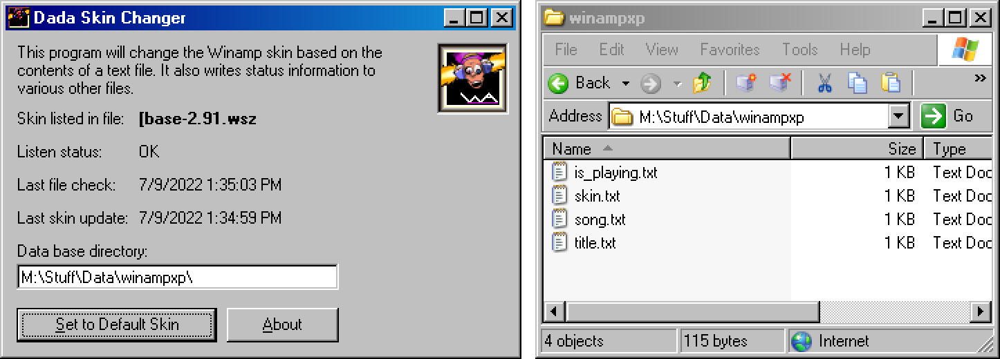

# Dada Skin Changer

A simple Visual Basic 6 script that reads from a file and then switches Winamp's current skin to whatever is the first line of that file.

It also stores a bunch of other information in various other files.

This script requires [gen_com.dll](https://github.com/winamp-libre/winamp-libre-archive/tree/master/plugins/gen/gen_com), which is used to communicate with Winamp.

This is a personal script made for my stream. Feel free to use it if you want to.

## Copyright

© MIT license
